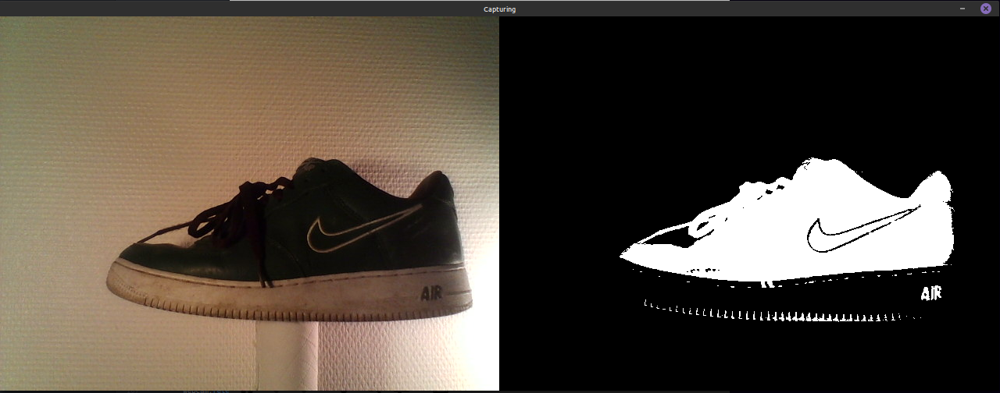

# Webcam Fashion MNIST
Python script to apply some basic knowledge regarding Tensorflow/Keras and OpenCV.

This script takes a picture using the webcam and then predicts the object with a simple neural network trained using the Fasion MNIST dataset.


## Results
Here you can find some successful results:

<div></div>
<div></div>
<div></div>

## Virtual enviroment
It is really recommended to use a virtual environment:
```
sudo apt update
sudo apt install python3-dev python3-pip
sudo pip3 install -U virtualenv  # system-wide install
```

Then create a new virtual environment
```
virtualenv --system-site-packages -p python3 ./venv
```
And activate it

```
source ./venv/bin/activate  # sh, bash, ksh, or zsh
```

# Packages required:
Install the following packages
```
pip install --upgrade tensorflow
pip install matplotlib
sudo apt install python3-opencv
```

# How to use:
1. Run ```python webcam_fashion_mnist.py```.
2. The webcam will start running.
3. If you want to quit, just press 'q'.
4. Bring the picture that you want to predict.
5. Once the object is in the right frame, press the key 's' to save a picture.
6. After hitting 's' the program will show the image in a 28x28 resolution and its prediction.
7. Press 'q' to close the result.

You can exit from the virtual environment using the command ```deactivate```.

## Author

* **Steven Macías** - *webcam_fashion_mnist script* - [StevenMacias](https://github.com/StevenMacias)

## Sources
* **freeCodeCamp.org** - *AI Knowledge* - [TensorFlow 2.0 Full Tutorial - Python Neural Networks for Beginners](https://www.youtube.com/watch?v=6g4O5UOH304)
* **kevinam99** - *Webcam Script* - [capturing-images-from-webcam-using-opencv-python](https://github.com/kevinam99/capturing-images-from-webcam-using-opencv-python)
